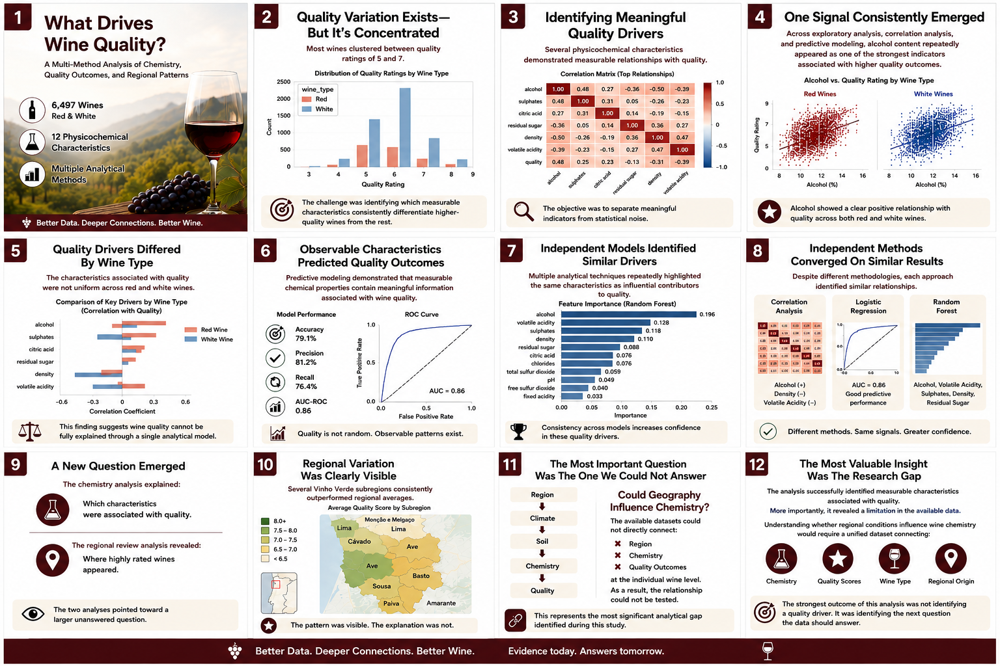

# Wine Quality Analysis: A Multi-Method Analytical Framework

**Author:** Micah Collins  
**Date:** June 7, 2026  
**Dataset:** UCI Wine Quality + Wine Enthusiast Reviews

**End-to-end data analytics project combining EDA, predictive modeling, geographic analysis, and executive storytelling.**



## Project Overview
This project examines wine quality through a comprehensive data analytics framework, combining **physicochemical analysis** with **regional review patterns** to understand the drivers of wine quality in Portuguese Vinho Verde wines.

## Project Highlights

- Analyzed 6,497 wine observations
- Built Logistic Regression and Random Forest models
- Identified alcohol as the strongest quality predictor
- Evaluated regional quality patterns across Vinho Verde subregions
- Developed executive-ready reporting and storytelling assets

## Deliverables

- [Executive Storyboard](wine-story-board.png)
- [Jupyter Notebook Analysis](Wine%20Analysis%20-%20Final%20Project%20(6).ipynb)
- [Publication-Ready PDF Report](Wine_Quality_Drivers_Publication_Ready.pdf)
- Supporting Visualizations

## Skills Demonstrated

- Exploratory Data Analysis (EDA)
- Statistical Analysis
- Predictive Modeling
- Logistic Regression
- Random Forest Classification
- Data Visualization
- Geographic Analysis
- Feature Importance Analysis
- Executive Reporting
- Data Storytelling

## Executive Summary

Wine quality is influenced by a complex interaction of physicochemical characteristics and regional factors. This analysis examines 6,497 red and white wine samples containing laboratory-measured attributes and corresponding quality ratings.

### Key Findings

1. **Alcohol Content** is the strongest and most consistent positive indicator of wine quality across all analytical methods
2. **Quality Drivers Differ by Wine Type** - Red and white wines show different patterns for alcohol, residual sugar, and density
3. **Geographic Variation Exists** - Certain Vinho Verde subregions (Sousa, Monção e Melgaço, Basto) consistently outperform regional averages
4. **Volatile Acidity** is negatively correlated with quality in both wine types
5. **Multiple Factors Interact** - Wine quality cannot be explained by a single characteristic

---

## Key Visualizations

### Quality Distribution by Wine Type


Most wines clustered between quality ratings of 5–7, highlighting that meaningful quality variation exists but is concentrated within a relatively narrow range.

### Exploratory Relationship Analysis


Exploratory analysis identified several measurable physicochemical characteristics associated with wine quality and provided early evidence that alcohol content may play a significant role.

### Correlation Analysis


Alcohol demonstrated the strongest positive correlation with quality, while volatile acidity exhibited one of the strongest negative relationships.

### Logistic Regression Models

#### Red Wine Model


The red wine classification model achieved approximately 82% accuracy and highlighted alcohol, sulphates, and fixed acidity as important predictors.

#### White Wine Model


The white wine model achieved approximately 73% accuracy and identified residual sugar, pH, and density as influential quality drivers.

### Random Forest Validation

#### Red Wine Feature Importance


#### White Wine Feature Importance


Random Forest analysis independently confirmed many of the same quality drivers identified through correlation analysis and logistic regression.

### Regional Quality Patterns


Regional review analysis revealed meaningful differences in average wine scores across Vinho Verde subregions.


### Geographic Visualization


Geographic analysis demonstrated that some subregions consistently outperformed regional averages, raising important questions regarding terroir and environmental influences on wine chemistry.

---

## Quick Start

### Installation

```bash
# Clone repository
git clone https://github.com/ccmicahleigh-cloud/wine-analysis.git
cd wine-analysis

# Create virtual environment
python -m venv venv
source venv/bin/activate  # On Windows: venv\Scripts\activate

# Install dependencies
pip install -r requirements.txt

# Download data files (place in data/ directory)
# - winequality-red.csv
# - winequality-white.csv
# - winemag-data-130k-v2.csv (optional for Phase 5)

# Run analysis
jupyter notebook Wine_Analysis_Complete.ipynb
```

## Project Structure

```
wine-analysis/
├── Wine_Analysis_Complete.ipynb      # Full Jupyter notebook
├── requirements.txt                  # Python dependencies
├── README.md                         # This file
├── .gitignore                        # Git ignore patterns
└── data/
    ├── winequality-red.csv          # Red wine data (UCI)
    ├── winequality-white.csv        # White wine data (UCI)
    └── winemag-data-130k-v2.csv     # Wine reviews (optional)
```

## Analytical Phases

### Phase 1: Data Quality Assessment
- Validation of data types, missing values, and duplicates
- **Result:** Dataset is clean with no missing values or duplicates

### Phase 2: Descriptive Statistical Analysis
- Summary statistics for all physicochemical variables
- Quality rating distribution analysis
- Wine classification into Poor/Good/Excellent categories

### Phase 3: Exploratory Relationship Analysis
- Regression plots comparing chemical characteristics to quality
- Correlation matrix analysis
- **Finding:** Alcohol shows strongest positive correlation (r=0.44); Volatile acidity shows strongest negative (r=-0.39)

### Phase 4: Predictive Modeling
- **Logistic Regression:** Binary classification of high-quality wines (quality ≥7)
  - Red wine accuracy: ~82%
  - White wine accuracy: ~73%
- **Random Forest Validation:** Nonlinear relationship validation
  - Confirms alcohol, sulphates as top predictors for red wines
  - Confirms residual sugar importance for white wines

### Phase 5: Regional Review Analysis (Optional)
- Analysis of 1,039 Vinho Verde wines from Wine Enthusiast reviews
- Subregion performance comparison
- Geographic visualization of quality patterns

## Key Variables Analyzed

| Variable | Description | Quality Relationship |
|----------|-------------|---------------------|
| Alcohol | Alcohol percentage | **Strong Positive** |
| Volatile Acidity | Acetic acid concentration | **Strong Negative** |
| Sulphates | Sulfate concentration | Positive |
| Density | Wine density | Negative |
| Residual Sugar | Remaining sugar after fermentation | Positive (esp. white) |
| Citric Acid | Citric acid content | Modest Positive |
| Fixed Acidity | Non-volatile acids | Modest Positive |
| Chlorides | Salt concentration | Negative |
| Free SO₂ | Free sulfur dioxide | Variable |
| Total SO₂ | Total sulfur dioxide | Negative |
| pH | Acidity/alkalinity | Variable |

## Vinho Verde Subregions Analyzed

| Subregion | Review Count | Avg Score | High-Quality Rate |
|-----------|-------------|-----------|-------------------|
| Sousa | 32 | 90.09 | 96.9% |
| Monção e Melgaço | 110 | 89.05 | 73.6% |
| Basto | 85 | 88.51 | 70.6% |
| Ave | 291 | 87.42 | 54.0% |
| Lima | 238 | 87.17 | 49.2% |
| Cavado | 141 | 87.02 | 49.0% |
| Amarante | 82 | 86.77 | 42.7% |
| Paiva | 44 | 86.16 | 36.4% |
| Baiao | 16 | 85.81 | 25.0% |

## Data Sources

### Primary Dataset: UCI Wine Quality
- **Source:** UCI Machine Learning Repository
- **Samples:** 6,497 wine observations (4,898 white, 1,599 red)
- **Variables:** 11 physicochemical measurements + quality rating
- **License:** Public Domain
- **Download:** https://archive.ics.uci.edu/ml/datasets/wine+quality

### Secondary Dataset: Wine Enthusiast Reviews
- **Source:** Wine Enthusiast Magazine reviews
- **Samples:** 130,000+ wine reviews globally; 1,039 Vinho Verde wines
- **Variables:** Country, province, region, points (rating), variety, winery, title, description
- **License:** Public/Academic Use
- **Download:** Kaggle Wine Reviews Dataset https://www.kaggle.com/datasets/roaldschuring/wine-reviews

## Analysis Methods

### Statistical Techniques
- Descriptive statistics (mean, std, quartiles)
- Correlation analysis (Pearson correlation matrix)
- Regression analysis (OLS trend lines by wine type)

### Machine Learning
- **Logistic Regression:** Binary classification (high-quality vs. other)
  - Train-test split: 75% training, 25% testing
  - Feature standardization with StandardScaler
  - Metrics: Accuracy, Precision, Recall, F1 Score, Confusion Matrix

- **Random Forest Classifier:** Nonlinear relationship validation
  - 300 estimators
  - Class weight balancing
  - 5-fold cross-validation
  - Metrics: ROC-AUC, Feature Importance

## Key Insights by Wine Type

### Red Wines Quality Drivers
1. **Alcohol** (strongest positive predictor)
2. **Sulphates** (positive)
3. **Fixed Acidity** (positive)
4. **Total Sulfur Dioxide** (strongest negative)
5. **Volatile Acidity** (negative)

### White Wines Quality Drivers
1. **Residual Sugar** (strongest positive predictor)
2. **pH** (positive)
3. **Fixed Acidity** (positive)
4. **Alcohol** (positive)
5. **Density** (strongest negative predictor)
6. **Volatile Acidity** (negative)

## Model Performance

### Logistic Regression Results

**Red Wine Model:**
- Accuracy: ~82%
- Precision: 0.82
- Recall: 0.38
- Top predictors: Alcohol, Sulphates, Fixed Acidity

**White Wine Model:**
- Accuracy: ~73%
- Precision: 0.68
- Recall: 0.35
- Top predictors: Residual Sugar, pH, Density

### Random Forest Results
- Confirms alcohol as top predictor for red wines
- Feature importance rankings align with logistic regression
- Validates presence of meaningful patterns in the data

## Limitations

1. **Disconnected Datasets:** UCI data lacks geographic information; review data lacks chemical measurements
2. **Sample Size Variation:** Some subregions have few reviews, increasing variability
3. **Temporal Factors:** Vintage years not consistently available in review data
4. **Quality Subjectivity:** Expert ratings influenced by individual preferences and tasting conditions
5. **Missing Confounds:** Producer, vineyard, fermentation method not in UCI data

## Future Research Opportunities

1. **Integrated Dataset Creation:** Combine chemistry, geography, and market data for the same wines
2. **Terroir Analysis:** Evaluate environmental factors (climate, soil) influencing chemistry
3. **Temporal Modeling:** Analyze quality trends across vintages
4. **Producer-Level Modeling:** Develop producer-specific quality prediction models
5. **Deep Learning:** Apply neural networks for nonlinear pattern discovery
6. **NLP Analysis:** Extract quality drivers from review text descriptions

## Contributing

This is a portfolio/research project. For inquiries or collaboration:
- Create an issue for discussion
- Submit a pull request with improvements

## License

This analysis and code are provided for educational and research purposes.

**Dataset Licenses:**
- UCI Wine Quality: Public Domain
- Wine Enthusiast Data: Academic/Research Use

## Citation

If you use this analysis or code, please reference:

```
Collins, M. (2026). Wine Quality Drivers: A Multi-Method Analytical Framework. 
Data Analytics Project, Vinho Verde Wine Analysis.
```

---

**Last Updated:** June 20, 2026  
**Status:** Complete - Analysis and documentation  
**Repository:** https://github.com/ccmicahleigh-cloud/wine-analysis
